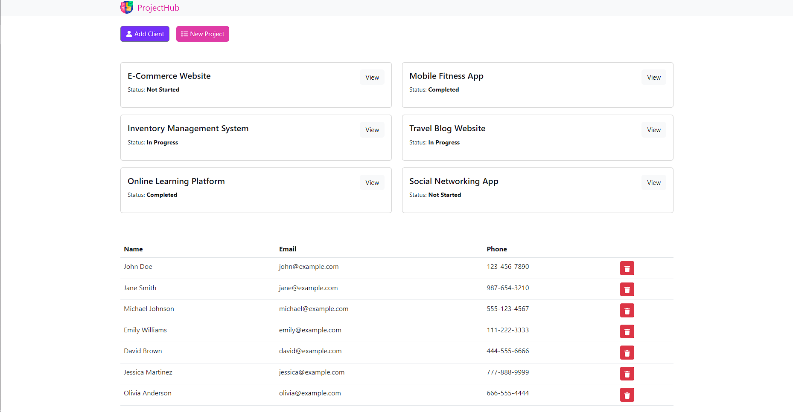
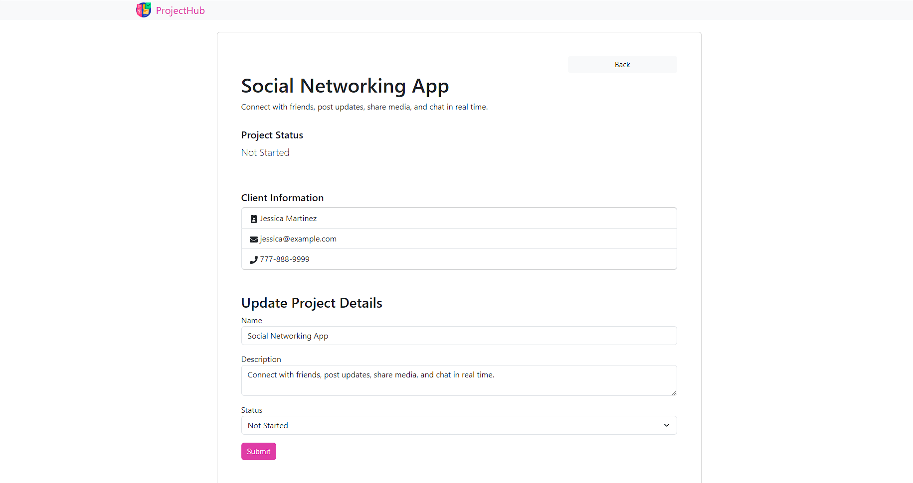

# ProjectHub - Project Management Web App

ProjectHub is a full-stack web application designed for efficient project management. Users can seamlessly manage clients and projects.

## Screenshots





## Demo

Check out the live demo of ProjectHub: [Demo Link](https://project-hub-bydex.netlify.app/)

## Features

- **Client Management:** Keep track of client details, ensuring easy access to relevant information.

- **Project Tracking:** Create and manage projects, associating them with specific clients for better organization.

- **Responsive Design:** Experience consistent usability across various devices, thanks to the fully responsive design.

- **User-Friendly Interface:** Intuitive UI/UX design ensures that users of all technical backgrounds can navigate the application effortlessly.

## Technologies Used

- Frontend

  - React.js
  - React Router
  - Apollo Client
  - Bootstrap

- Backend
  - Node.js
  - Express.js
  - MongoDB
  - Mongoose
  - GraphQL

## Getting Started

Follow these steps to set up and run ProjectHub on your local machine:

1. **Clone the Repository:** Clone this repository to your local machine:

   ```bash
   git clone https://github.com/soham-basak/ProjectHub.git

   ```

2. **Install Dependencies:** Navigate to the project directory and install frontend and backend dependencies:

   ```bash
   cd projecthub
   npm install
   cd client
   npm install
   ```

3. **Database Setup:** Configure your MongoDB database and update dotenv file with the connection details.

4. **Run the Application:** Start the frontend and backend:

   ```bash
   cd projecthub
   npm run dev
   cd projecthub/client
   npm start
   ```

5. **Access ProjectHub:** Open your web browser and go to http://localhost:3000 to access ProjectHub.

## Authors

- [Dexter](https://github.com/soham-basak)
